Data preparation
================
Raphael Eisenhofer
1/7/2023

# Analyses by Raphael

    ## ── Attaching core tidyverse packages ──────────────────────── tidyverse 2.0.0 ──
    ## ✔ dplyr     1.1.2     ✔ readr     2.1.4
    ## ✔ forcats   1.0.0     ✔ stringr   1.5.0
    ## ✔ ggplot2   3.4.2     ✔ tibble    3.2.1
    ## ✔ lubridate 1.9.2     ✔ tidyr     1.3.0
    ## ✔ purrr     1.0.1     
    ## ── Conflicts ────────────────────────────────────────── tidyverse_conflicts() ──
    ## ✖ dplyr::filter() masks stats::filter()
    ## ✖ dplyr::lag()    masks stats::lag()
    ## ℹ Use the conflicted package (<http://conflicted.r-lib.org/>) to force all conflicts to become errors

### Number of sample types/distribution of host taxonomy

    ## Rows: 1042 Columns: 66
    ## ── Column specification ────────────────────────────────────────────────────────
    ## Delimiter: " "
    ## chr (30): preprocessing_id, preprocessing_batch, sequence_id, index_id, refe...
    ## dbl (36): reads_pre_fastp, reads_post_fastp, bases_pre_fastp, bases_post_fas...
    ## 
    ## ℹ Use `spec()` to retrieve the full column specification for this data.
    ## ℹ Specify the column types or set `show_col_types = FALSE` to quiet this message.
    ## `summarise()` has grouped output by 'sample_type'. You can override using the `.groups` argument.

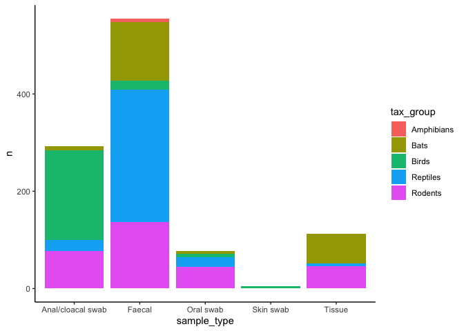<!-- -->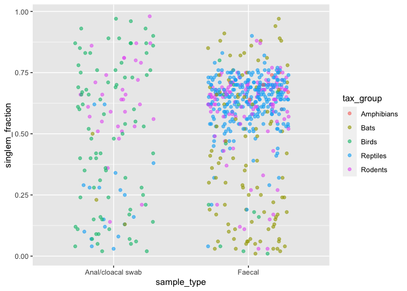<!-- -->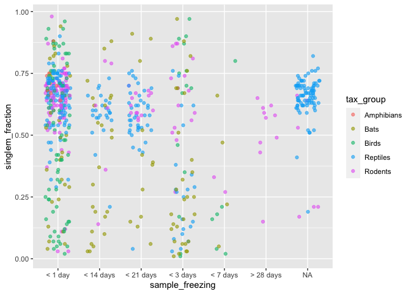<!-- -->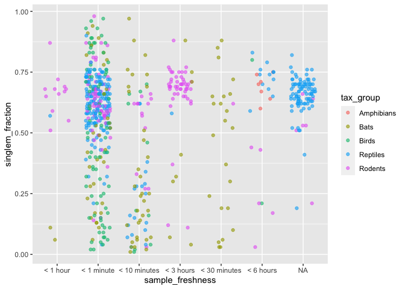<!-- -->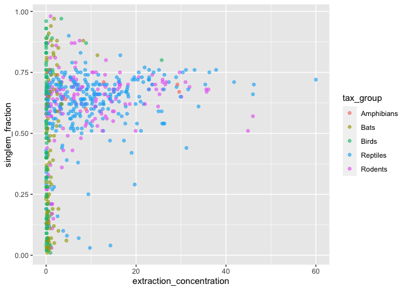<!-- -->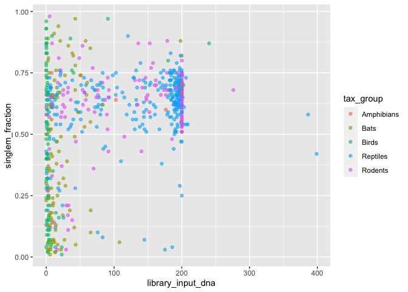<!-- -->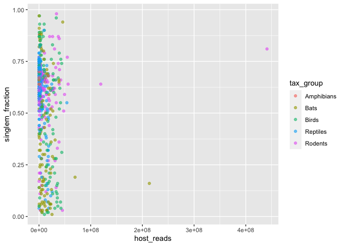<!-- -->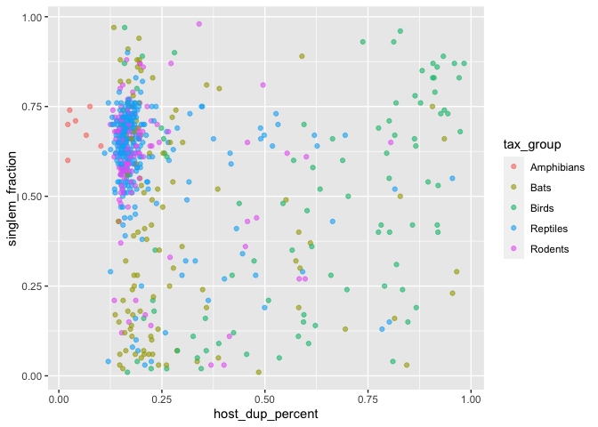<!-- -->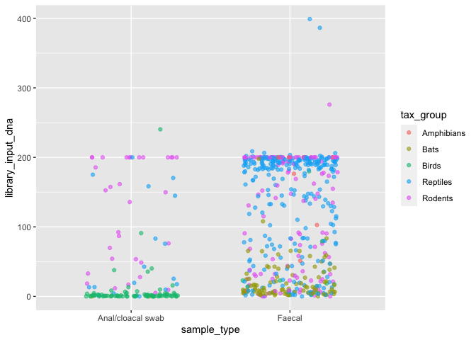<!-- -->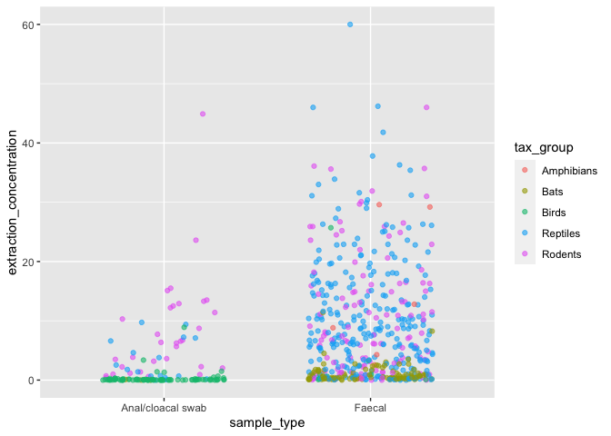<!-- -->

# Looking at poor samples in detail

    ## Rows: 1042 Columns: 66
    ## ── Column specification ────────────────────────────────────────────────────────
    ## Delimiter: " "
    ## chr (30): preprocessing_id, preprocessing_batch, sequence_id, index_id, refe...
    ## dbl (36): reads_pre_fastp, reads_post_fastp, bases_pre_fastp, bases_post_fas...
    ## 
    ## ℹ Use `spec()` to retrieve the full column specification for this data.
    ## ℹ Specify the column types or set `show_col_types = FALSE` to quiet this message.

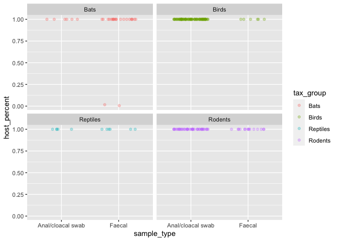<!-- -->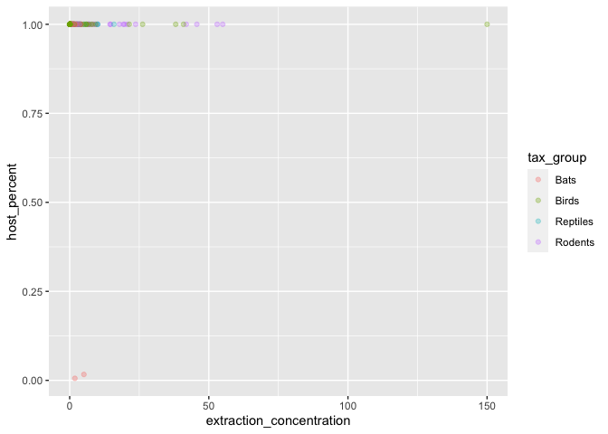<!-- -->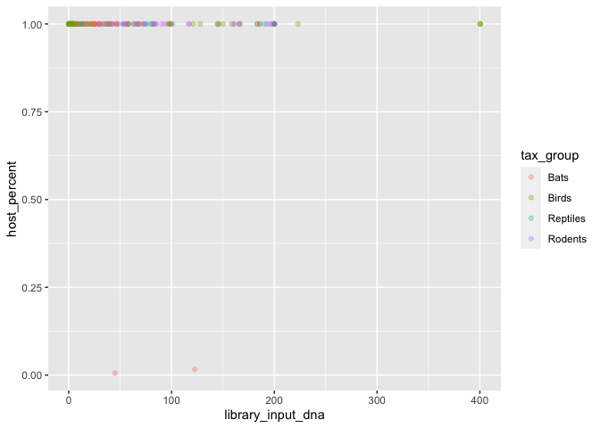<!-- -->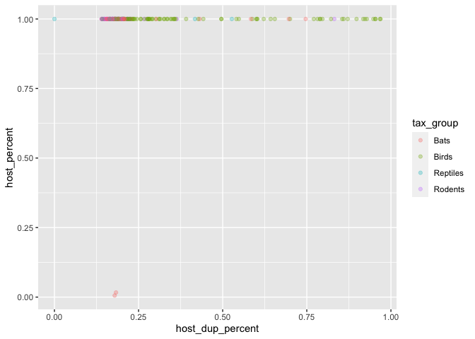<!-- -->
